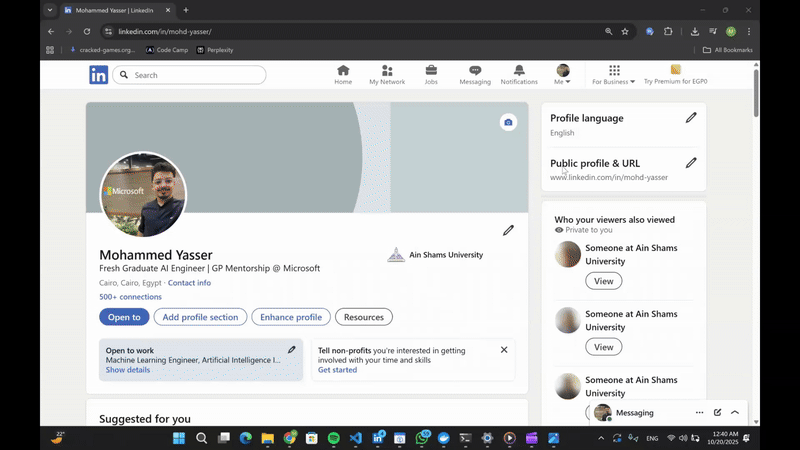

# AI LinkedIn Message Generator

[](https://www.crewai.com/)
[](https://fastapi.tiangolo.com/)
[](https://developer.chrome.com/docs/extensions/)
[](https://opensource.org/licenses/MIT)


This is a browser extension that uses a multi-agent AI system to generate highly personalized outreach messages for LinkedIn.

It goes beyond simple templates by performing a deep analysis of both your profile and your target's profile to find strategic "connection vectors". It then uses an "Executive Ghostwriter" agent to craft a message based on your specified tone, length, and call to action.

---


## 🚀 Key Features

* **Multi-Agent AI System**: Utilizes a `crewai`-based backend with specialized agents for profile processing, strategic analysis, and message writing.
* **AI-Powered Profile Analysis**: Doesn't just scrape names. It parses the full HTML of both your profile and the target's profile to understand experience, education, skills, and recent activity.
* **Strategic Generation**: The "Engagement Strategist" agent identifies the most potent `ConnectionVector`s (e.g., shared experiences, timely hooks from recent activity) and assesses the `seniority_dynamic` (e.g., 'Junior to Senior') to guide the message's content.
* **AI Ghostwriter**: A dedicated "Executive Ghostwriter" agent takes the strategic brief and your inputs (tone, length, CTA) to draft a natural, compelling, and non-generic message.
* **One-Click User Profiling**: An options page allows the extension to parse your *own* LinkedIn profile to create a detailed JSON model of your skills, interests, and strengths.
* **Customizable Output**: Control the message's **Tone** (e.g., professional, friendly), **Length** (e.g., short, medium, 'Connection Request' for the 200-char limit), and include a specific **Call to Action**.

## 🛠️ How it Works (Architecture)

This project consists of two main components: the Chrome Extension frontend and a FastAPI backend.

### 1. FastAPI (Backend)

* `app/endpoint.py`: The main entry point and core API logic. Defines all AI agents and API endpoints.
    * `/parse_profile`: This endpoint receives the HTML of the user's *own* profile. It uses the `linkedin_profile_processor` agent to parse it into a structured `LinkedInProfile` Pydantic model and returns the JSON. This JSON is then stored by the extension.
    * `/generate`: This is the main generation endpoint. It receives a `GenerateMessageRequest` containing the user's stored profile JSON, the target's raw HTML, and the message parameters (tone, length, etc.).
* **AI Agent Crew**:
    1.  **`linkedin_profile_processor`**: An agent that parses the *target's* HTML into the same `LinkedInProfile` JSON structure.
    2.  **`engagement_strategist`**: An agent that receives both the user's and target's JSON profiles. It compares them to generate an `EngagementBrief`, which includes the `seniority_dynamic` and a ranked list of `ConnectionVector`s.
    3.  **`message_writer_agent`**: The "Executive Ghostwriter." It receives the `EngagementBrief` from the strategist and the user's form inputs (tone, length, CTA) to write the final, polished message.

### 2. Chrome Extension (Frontend)

* `popup.js`: Manages the main extension popup. It captures user inputs (tone, length, CTA) and validates that the user's profile and API key are configured before sending the request.
* `content.js`: This content script is injected into active LinkedIn profile pages. Its sole job is to extract the `<main>` HTML content of the profile when requested.
* `options.js`: Powers the settings page. It handles saving/testing the Gemini API key and includes the "Prefill" logic that reads the user's *own* profile HTML and sends it to the `/parse_profile` endpoint.
* `background.js`: The service worker. It acts as the central router, listening for messages from the popup and options page. It makes the `fetch` calls to the backend API (`/parse_profile` and `/generate`), passing the API key in the Authorization header.
* `shared.js`: Contains shared utility functions used by popup, options, and background scripts (API key retrieval, profile parsing logic, error handling).


## 💻 Tech Stack

* **Backend**: Python 3.12, FastAPI, CrewAI, Pydantic, Uvicorn
* **Frontend**: Vanilla JavaScript (ES Modules), HTML5, CSS3
* **Deployment**: Docker

## 🔧 Installation & Usage (End User)

1.  **Install the Extension**: (e.g., "Download from the Chrome Web Store.")
2.  **Add Your API Key**:
    * Click the extension icon, click the "Options" (gear) icon, or right-click the extension icon and select "Options."
    * On the 'Settings' tab, enter your Google Gemini API key and click "Save API Key." Use the "Test API Key" button to ensure it's working.
3.  **Set Up Your Profile**:
    * Go to the 'My Profile' tab on the same Options page.
    * Open your *own* LinkedIn profile in a new tab.
    * Return to the Options page and click "Prefill from current LinkedIn tab." The AI will parse your profile and save your professional data.





4.  **Generate a Message**:
    * Navigate to any target's LinkedIn profile page (e.g., `linkedin.com/in/some-person`).
    * Click the extension icon in your toolbar.
    * Select your desired Tone, Length, and add a Call to Action (e.g., "a 15-minute call").
    * Click "Generate Message."
    * The message will appear in the popup, where you can edit it and copy it to your clipboard.

## 👨‍💻 Developer Setup (Local)

To run this project locally for development:

### Backend

1.  **Navigate to Directory**: `cd` into the project's root folder.
2.  **Install Dependencies**:
    ```bash
    pip install -r requirements.txt
    ```
3.  **Run Server**:
    ```bash
    uvicorn main:app --host 0.0.0.0 --port 8000 --reload
    ```
    The backend will now be running on `http://localhost:8000`.

### Frontend (Extension)

1.  **Update Server URL**:
    * Open `background.js`.
    * Change the `SERVER_URL` constant from the production URL to your local one:
        ```javascript
        const SERVER_URL = 'http://localhost:8000';
        ```
2.  **Load the Extension**:
    * Open Google Chrome and navigate to `chrome://extensions`.
    * Enable "Developer mode" in the top-right corner.
    * Click "Load unpacked."
    * Select the entire project directory.
3.  The extension will now be installed locally. You can follow the "Installation & Usage" steps above. Any changes to the frontend code will require you to click the "reload" button on the `chrome://extensions` page for this extension.

## 📄 License

This project is licensed under the MIT License.